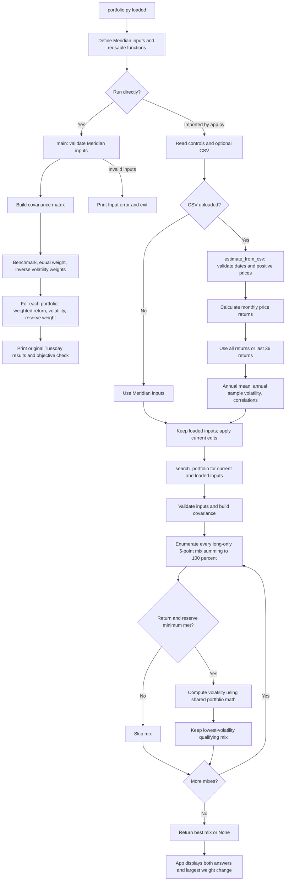

# Portfolio flowchart

Run the app with `python -m streamlit run app.py`.

```mermaid
flowchart TD
    A[portfolio.py loaded] --> B[Define Meridian inputs and reusable functions]
    B --> C{Run directly?}
    C -->|Yes| D[main: validate Meridian inputs]
    D --> E[Build covariance matrix]
    E --> F[Benchmark, equal weight, inverse volatility weights]
    F --> G[For each portfolio: weighted return, volatility, reserve weight]
    G --> H[Print original Tuesday results and objective check]
    D -->|Invalid inputs| I[Print Input error and exit]
    C -->|Imported by app.py| J[Read controls and optional CSV]
    J --> K{CSV uploaded?}
    K -->|No| L[Use Meridian inputs]
    K -->|Yes| M[estimate_from_csv: validate dates and positive prices]
    M --> N[Calculate monthly price returns]
    N --> O[Use all returns or last 36 returns]
    O --> P[Annual mean, annual sample volatility, correlations]
    L --> Q[Keep loaded inputs; apply current edits]
    P --> Q
    Q --> R[search_portfolio for current and loaded inputs]
    R --> S[Validate inputs and build covariance]
    S --> T[Enumerate every long-only 5-point mix summing to 100 percent]
    T --> U{Return and reserve minimum met?}
    U -->|No| V[Skip mix]
    U -->|Yes| W[Compute volatility using shared portfolio math]
    W --> X[Keep lowest-volatility qualifying mix]
    V --> Y{More mixes?}
    X --> Y
    Y -->|Yes| T
    Y -->|No| Z[Return best mix or None]
    Z --> AA[App displays both answers and largest weight change]
```
